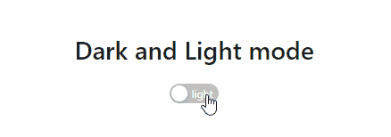

# React Dark Mode
> use create-react-app and react context develop dark mode function

demo [_here_](https://areslin1201.github.io/react-dark-mode/)

other language: [ENGLISH](README.md), [繁體中文](README.zh-tw.md)

## Information
- use create-react-app framework to accomplish dark mode button

## Technologies Used
- React 18.1.0
- antd 4.21.0

## Usage
start the project

`npm run start`